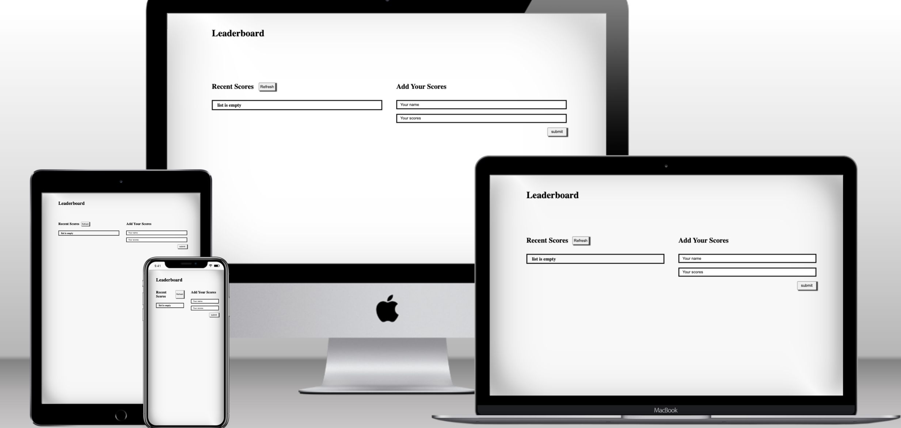

# Project Name

> Leaderboard score.

## Description

-The leaderboard website displays scores submitted by different players. It also allows you to submit your score. All data is preserved thanks to the external [Leaderboard API service](https://www.notion.so/microverse/Leaderboard-API-service-24c0c3c116974ac49488d4eb0267ade3).

## Built With

- HTML, CSS, ES6
- Webpack
- API

### Prerequisites

- Vistual Studio Code
- Browser (Firefox / Google Chrome)
- Node.js (v6.11.2+)
- linters

## Getting Started

To get a local copy up and running follow these simple example steps.

## Install Dependencies(with following Command)

- npm install --save -dev

## Build webpack

- run command npm run build

## Start server

- npm start

## To test the app run following command

- npm test

### Usage

Showcase your todo list.

## Live Demo (if available)

[Live Demo Link](https://shella12.github.io/Leaderboard.github.io/dist)

## Authors

👤 **Author1**

- GitHub: [@shella12](https://github.com/shella12)
- Twitter: [@Ayesha Arshad](https://twitter.com/AyeshaA03712974)
- LinkedIn: [Ayesha Arshad](https://www.linkedin.com/in/ayesha-arshad-a690a015a/)

## 🤝 Contributing

Contributions, issues, and feature requests are welcome!

Feel free to check the [issues page](../../issues/).

## Show your support

Give a ⭐️ if you like this project!

## 📝 License

This project is [MIT](./LICENSE) licensed.

_NOTE: we recommend using the [MIT license](https://choosealicense.com/licenses/mit/) - you can set it up quickly by [using templates available on GitHub](https://docs.github.com/en/communities/setting-up-your-project-for-healthy-contributions/adding-a-license-to-a-repository). You can also use [any other license](https://choosealicense.com/licenses/) if you wish._
